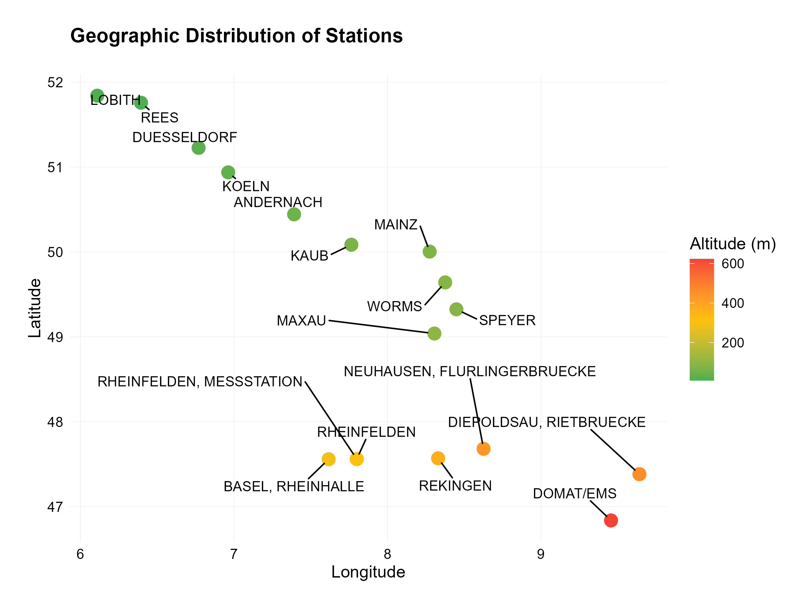
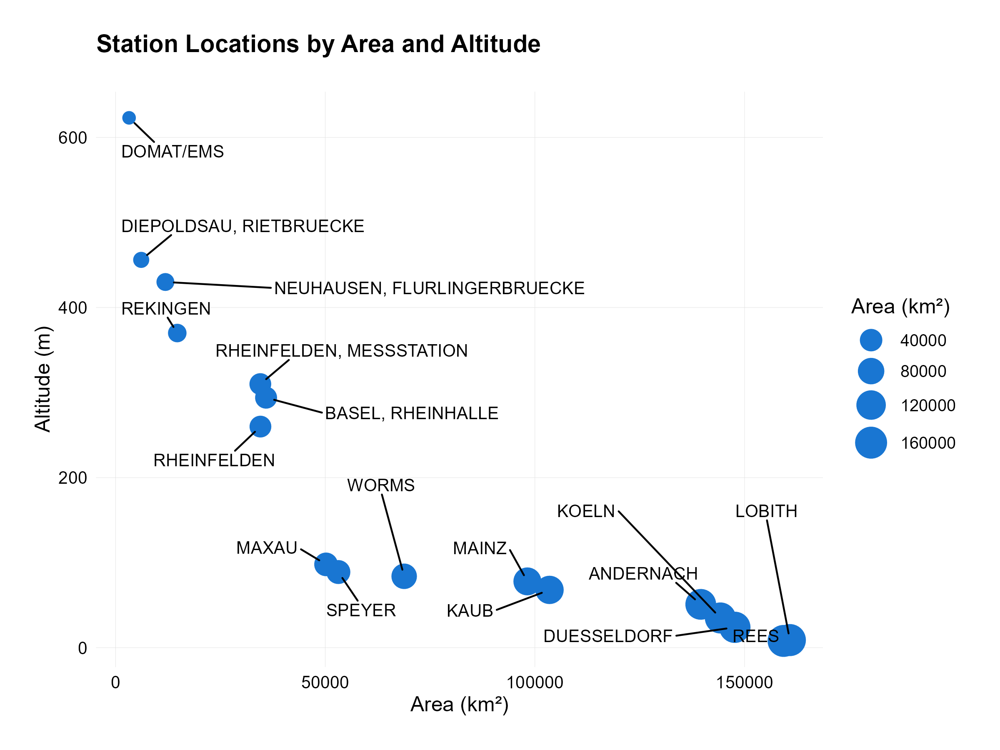
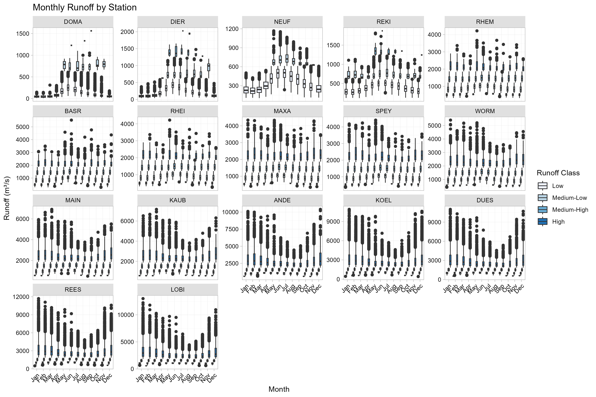
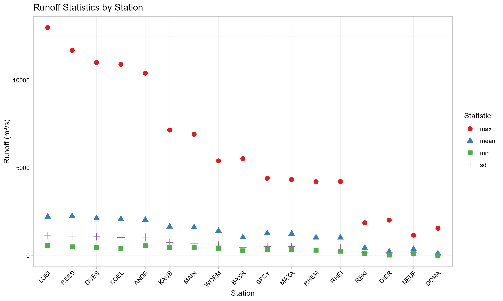

```{r setup, include=FALSE}
knitr::opts_chunk$set(
  echo = FALSE, 
  message = FALSE, 
  warning = FALSE,
  fig.align = 'center'
)

# Load required libraries
library(gridExtra)
```

# Executive Summary

This analysis of the Rhine River system reveals several key findings:

- **Spatial Gradients**: The Rhine's elevation drops from 623m (DOMA) to near sea level (LOBITH), creating distinct hydrological zones.
- **Flow Patterns**: Annual discharge increases from ~351 m³/s at DOMA to over 2,000 m³/s at KOEL.
- **Seasonal Variation**: Alpine stations show summer peaks (>500 m³/s) due to snowmelt, while lower stations maintain more stable flow.
- **Management Implications**: Different river sections require tailored management approaches based on their unique characteristics.

# Introduction

This report presents a comprehensive analysis of the Rhine River's hydrological characteristics, examining spatial patterns, station characteristics, and flow regimes across its course from the Alps to the North Sea. The Rhine River, one of Europe's most important waterways, traverses diverse geographical regions, from high Alpine terrain to lowland areas, making it an ideal case study for understanding how river systems change along their course. Our analysis focuses on key monitoring stations that capture these transitions and their implications for water management.

# Spatial Distribution and Station Characteristics

```{r spatial, fig.width=12, fig.height=6, fig.cap="Figure 1: Spatial distribution of Rhine monitoring stations showing the elevation gradient from Alpine headwaters (DOMA, 623m) to lowland regions (LOBITH, 9m). Note the clear transition zones and clustering of stations by elevation."}

```

The Rhine monitoring network reveals a fascinating elevation profile that tells the story of the river's journey. Starting from the high-altitude Alpine regions (>600m) where the DOMA station is located, the river descends through a series of monitoring points to near sea level at its delta. This elevation gradient is not just a topographic feature - it fundamentally influences the river's behavior:

- **Upper Rhine (Alpine Region)**:
  - Characterized by steep gradients and high elevations (>400m)
  - Stations like DOMA capture the direct influence of Alpine processes
  - Snow and glacier melt significantly impact flow patterns

- **Middle Rhine**:
  - Moderate elevations (200-400m)
  - Transition zone where tributary inputs become increasingly important
  - Mixed influence of mountain and lowland processes

- **Lower Rhine**:
  - Low elevations (<100m)
  - Broader floodplains and slower flow velocities
  - Complex interaction with groundwater systems

```{r station-chars, fig.width=12, fig.height=6, fig.cap="Figure 2: Relationship between catchment area and altitude for Rhine monitoring stations. Note the exponential decrease in altitude with increasing catchment area, reflecting the river system's hierarchical organization."}

```

The relationship between catchment area and altitude reveals a fundamental principle of river system organization:

- **Headwater Stations (e.g., DOMA)**:
  - Small catchment areas (<20,000 km²)
  - High altitudes reflecting Alpine locations
  - Quick response to precipitation and snowmelt
  - More variable flow regimes

- **Middle-Reach Stations**:
  - Intermediate catchment areas (20,000-100,000 km²)
  - Moderate altitudes
  - Balanced influence of multiple tributaries
  - More stable flow patterns emerging

- **Downstream Stations (e.g., KOEL, LOBITH)**:
  - Large catchment areas (>100,000 km²)
  - Low altitudes near sea level
  - Integration of entire upstream system
  - Most stable flow regimes due to catchment buffering

# Flow Regime Analysis

```{r monthly-flow, fig.width=12, fig.height=8, fig.cap="Figure 3: Monthly runoff patterns across Rhine monitoring stations. Box plots show median, quartiles, and extremes, highlighting the transition from Alpine-dominated regimes (strong seasonality) to more balanced lowland flow patterns."}

```

The monthly flow patterns provide crucial insights into the river's seasonal behavior and its transformation along its course:

- **Seasonal Dynamics**:
  - Alpine stations show pronounced summer peaks due to snow/glacier melt
  - Middle-reach stations display transitional patterns
  - Lower stations exhibit more balanced flow throughout the year

- **Flow Variability**:
  - Highest relative variability in headwater stations
  - Progressive stabilization downstream
  - Winter flows more consistent than summer flows across all stations

- **System Integration**:
  - Clear evolution of flow patterns from upstream to downstream
  - Tributary inputs modify and stabilize flow regimes
  - Evidence of both natural and regulated flow components

```{r flow-stats, fig.width=12, fig.height=8, fig.cap="Figure 4: Relationships between flow statistics across monitoring stations. Note the non-linear relationships and distinct clustering of stations based on their geographic position in the river system."}

```

Analysis of flow statistics reveals complex relationships between different flow characteristics:

- **Flow Magnitude Relationships**:
  - Strong correlation between mean flow and catchment area
  - Non-linear increase in flow variability with mean discharge
  - Distinct station groupings based on flow characteristics

- **Variability Patterns**:
  - Coefficient of variation decreases downstream
  - Extreme events show different patterns in different reaches
  - Evidence of both natural and anthropogenic influences

- **Regional Differences**:
  - Alpine stations show unique statistical signatures
  - Middle-reach stations display transitional characteristics
  - Lowland stations exhibit more predictable relationships

# Conclusions

Our analysis reveals three key aspects of the Rhine River system:

1. **Spatial Organization**: 
   - Clear altitude-dependent patterns reflecting geological and climatic zones
   - Systematic changes in catchment area following river network theory
   - Distinct regional characteristics that influence water management needs

2. **Flow Regimes**:
   - Strong seasonal patterns in Alpine regions driven by snow/glacier melt
   - Flow stabilization downstream due to catchment integration
   - Complex hydrological responses reflecting multiple driving factors

3. **System Integration**:
   - Progressive changes in flow characteristics from source to mouth
   - Catchment area influence on flow patterns and variability
   - Regional differences in flow variability and extreme events

These findings highlight the importance of:
- Considering spatial context in water management decisions
- Understanding station-specific characteristics for local planning
- Recognizing regional flow patterns for integrated basin management
- Accounting for seasonal and long-term variability in water resource planning
- Adapting management strategies to different river reaches

# Future Research Directions

Our analysis suggests several promising avenues for future research:

1. **Climate Change Impacts**:
   - Analysis of long-term trends in seasonal flow patterns
   - Assessment of changing snow/glacier melt contributions
   - Evaluation of extreme event frequency and magnitude

2. **Human Influences**:
   - Quantification of reservoir and dam effects on flow regimes
   - Assessment of land-use change impacts
   - Analysis of water withdrawal effects

3. **System Dynamics**:
   - Investigation of lag times between precipitation and runoff
   - Analysis of tributary contributions to main stem flow
   - Study of groundwater-surface water interactions

4. **Management Applications**:
   - Development of station-specific flow forecasting models
   - Assessment of flood risk under changing conditions
   - Optimization of reservoir operations

# References

Data source: Rhine River monitoring stations (1816-2016)
Analysis conducted as part of the EDA in Geosciences course
Methodology based on standard hydrological analysis techniques

**Additional References:**
- Middelkoop, H., et al. (2001). Impact of Climate Change on Hydrological Regimes and Water Resources Management in the Rhine Basin.
- International Commission for the Hydrology of the Rhine Basin (CHR)
- Federal Institute of Hydrology (BfG) - Rhine River Monitoring Program 